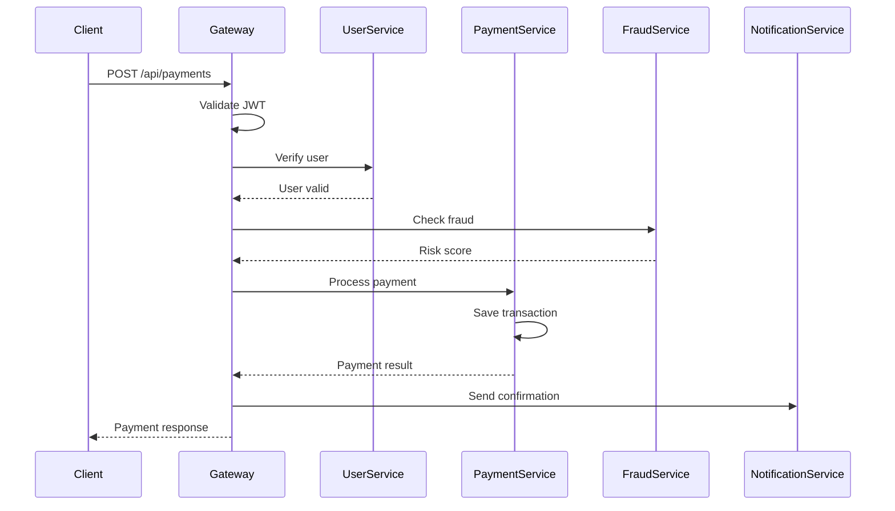

# Architecture Overview

PayNext follows a microservices architecture pattern with cloud-native design principles, providing scalability, resilience, and maintainability.

## Table of Contents

- [High-Level Architecture](#high-level-architecture)
- [System Components](#system-components)
- [Service Communication](#service-communication)
- [Data Flow](#data-flow)
- [Security Architecture](#security-architecture)
- [Deployment Architecture](#deployment-architecture)

## High-Level Architecture

```
┌─────────────────────────────────────────────────────────────────┐
│                        Client Layer                              │
│  ┌──────────────┐    ┌──────────────┐    ┌──────────────┐      │
│  │ Web Dashboard│    │  Mobile App  │    │  Third-Party │      │
│  │  (React 18)  │    │  (Next.js)   │    │     APIs     │      │
│  └──────┬───────┘    └──────┬───────┘    └──────┬───────┘      │
└─────────┼──────────────────┼──────────────────┼────────────────┘
          │                  │                  │
          └──────────────────┼──────────────────┘
                             │
┌────────────────────────────┼───────────────────────────────────┐
│                   API Gateway Layer                             │
│         ┌──────────────────┴──────────────────┐                │
│         │    API Gateway (Spring Cloud)       │                │
│         │  - Routing                          │                │
│         │  - Authentication                   │                │
│         │  - Rate Limiting                    │                │
│         └──────────────────┬──────────────────┘                │
└────────────────────────────┼───────────────────────────────────┘
                             │
┌────────────────────────────┼───────────────────────────────────┐
│                  Service Discovery Layer                        │
│            ┌─────────────────────────────┐                      │
│            │   Eureka Server (Netflix)   │                      │
│            │   - Service Registration    │                      │
│            │   - Health Monitoring       │                      │
│            └─────────────────────────────┘                      │
└─────────────────────────────────────────────────────────────────┘
                             │
┌────────────────────────────┼───────────────────────────────────┐
│                  Microservices Layer                            │
│  ┌───────────┐  ┌───────────┐  ┌──────────┐  ┌─────────────┐  │
│  │   User    │  │  Payment  │  │Transaction│  │Notification │  │
│  │  Service  │  │  Service  │  │  Service  │  │   Service   │  │
│  └─────┬─────┘  └─────┬─────┘  └─────┬────┘  └──────┬──────┘  │
│        │              │              │               │          │
└────────┼──────────────┼──────────────┼───────────────┼──────────┘
         │              │              │               │
┌────────┼──────────────┼──────────────┼───────────────┼──────────┐
│        │    ML Services Layer (Python/FastAPI)       │          │
│  ┌─────┴──┐  ┌────────┴──┐  ┌────────┴────┐  ┌──────┴──────┐  │
│  │ Fraud  │  │  Credit   │  │    Churn    │  │Categorization│ │
│  │Detection│  │ Scoring   │  │ Prediction  │  │   Service    │ │
│  └────────┘  └───────────┘  └─────────────┘  └──────────────┘  │
└─────────────────────────────────────────────────────────────────┘
         │              │              │               │
┌────────┼──────────────┼──────────────┼───────────────┼──────────┐
│                    Data & Infrastructure Layer                   │
│  ┌───────────┐  ┌──────────┐  ┌──────────┐  ┌──────────────┐  │
│  │   MySQL   │  │  Redis   │  │ RabbitMQ │  │  Monitoring  │  │
│  │ (Primary) │  │  (Cache) │  │(Messaging)│ │(Prometheus)  │  │
│  └───────────┘  └──────────┘  └──────────┘  └──────────────┘  │
└─────────────────────────────────────────────────────────────────┘
```

## System Components

### 1. API Gateway

**Purpose**: Centralized entry point for all client requests

**File**: `backend/api-gateway/`

**Responsibilities**:

- Request routing to microservices
- JWT token validation
- Rate limiting and throttling
- Circuit breaking
- Request/response logging

**Technology**: Spring Cloud Gateway (Reactive)

### 2. Service Registry (Eureka)

**Purpose**: Service discovery and health monitoring

**File**: `backend/eureka-server/`

**Responsibilities**:

- Dynamic service registration
- Service instance health checks
- Load balancing coordination
- Service metadata management

**Technology**: Netflix Eureka

### 3. User Service

**Purpose**: User account and authentication management

**File**: `backend/user-service/`

**Responsibilities**:

- User registration and profile management
- Authentication (JWT generation)
- Role-based access control (RBAC)
- Password management and security

**Database**: MySQL (user_db)

**Key Entities**: User, Role, Permission

### 4. Payment Service

**Purpose**: Core payment processing

**File**: `backend/payment-service/`

**Responsibilities**:

- Payment transaction processing
- Multiple payment method support
- Multi-currency handling
- Payment gateway integration
- Transaction validation

**Database**: MySQL (payment_db)

**Cache**: Redis

**Key Entities**: Payment, PaymentMethod, Currency

### 5. Transaction Service

**Purpose**: Transaction history and reconciliation

**File**: `backend/transaction-service/` (planned/integrated with payment-service)

**Responsibilities**:

- Transaction recording and tracking
- Refund processing
- Chargeback handling
- Financial reconciliation
- Audit trail

### 6. Notification Service

**Purpose**: Multi-channel notifications

**File**: `backend/notification-service/`

**Responsibilities**:

- Email notifications (SMTP)
- SMS notifications
- Push notifications
- Notification templates
- Delivery tracking

**Database**: MySQL (notification_db)

**Message Queue**: RabbitMQ/Kafka

### 7. Fraud Detection Service

**Purpose**: AI-powered fraud prevention

**File**: `ml_services/fraud/`

**Responsibilities**:

- Real-time fraud scoring
- Anomaly detection
- Risk assessment
- Model training and updating

**Technology**: Python, FastAPI, scikit-learn

**Models**: Random Forest, Isolation Forest, Autoencoder

## Service Communication

### Synchronous Communication (REST)

Services communicate via RESTful APIs through the API Gateway:

```
Client → API Gateway → Service Registry → Target Service
```

**Example Flow**:

1. Client sends request to API Gateway
2. Gateway validates JWT token
3. Gateway discovers service location from Eureka
4. Gateway routes request to service
5. Service processes and returns response

### Asynchronous Communication (Message Queue)

Event-driven communication for non-blocking operations:

```
Service → RabbitMQ/Kafka → Subscribed Services
```

**Use Cases**:

- Payment confirmation emails
- Fraud alert notifications
- Transaction logs
- Analytics events

## Data Flow

### Payment Processing Flow



### Authentication Flow

```
1. User → API Gateway: POST /users/login {username, password}
2. Gateway → User Service: Forward credentials
3. User Service → Database: Validate credentials
4. User Service → JWT Util: Generate token
5. User Service → Gateway: Return JWT token
6. Gateway → User: Return token
```

### Fraud Detection Integration

```
1. Payment Service: Receive payment request
2. Payment Service → Fraud Service: Send transaction data
3. Fraud Service → ML Model: Predict fraud probability
4. ML Model → Fraud Service: Return risk score
5. Fraud Service → Payment Service: Fraud assessment
6. Payment Service: Approve/Decline based on score
```

## Security Architecture

### Authentication & Authorization

**JWT-Based Authentication**:

- Stateless token-based auth
- 1-hour token expiry
- Refresh token support
- Token stored in HTTP-only cookies

**RBAC Model**:

```
User → Role → Permissions
```

Roles: USER, MERCHANT, ADMIN

### Data Security

**Encryption**:

- TLS 1.3 for data in transit
- AES-256 for sensitive data at rest
- Payment data tokenization

**Compliance**:

- PCI DSS Level 1
- GDPR compliant
- SOC 2 Type II (planned)

## Deployment Architecture

### Docker Compose (Development)

```yaml
services:
  - eureka-server
  - api-gateway
  - user-service
  - payment-service
  - notification-service
  - mysql
  - redis
  - rabbitmq
```

### Kubernetes (Production)

```
Namespace: paynext
├── Deployments
│   ├── eureka-server (replicas: 1)
│   ├── api-gateway (replicas: 3)
│   ├── user-service (replicas: 2)
│   ├── payment-service (replicas: 3)
│   └── notification-service (replicas: 2)
├── Services (ClusterIP, LoadBalancer)
├── Ingress (HTTPS)
├── ConfigMaps & Secrets
└── Persistent Volumes (MySQL, Redis)
```

### Cloud Architecture (AWS Example)

```
- VPC with public/private subnets
- EKS cluster for microservices
- RDS MySQL (Multi-AZ)
- ElastiCache Redis
- Application Load Balancer
- Route53 DNS
- CloudWatch monitoring
- S3 for backups
```

## Module-to-File Mapping

| Module               | Primary Files                       | Dependencies        |
| -------------------- | ----------------------------------- | ------------------- |
| API Gateway          | `backend/api-gateway/src/`          | Eureka, JWT         |
| Eureka Server        | `backend/eureka-server/src/`        | None                |
| User Service         | `backend/user-service/src/`         | MySQL, Eureka, JWT  |
| Payment Service      | `backend/payment-service/src/`      | MySQL, Redis, Kafka |
| Notification Service | `backend/notification-service/src/` | MySQL, RabbitMQ     |
| Fraud Detection      | `ml_services/fraud/`                | Python, FastAPI     |
| Common Module        | `backend/common-module/src/`        | Shared utilities    |

## Scalability Patterns

### Horizontal Scaling

- Services run as multiple replicas
- Load balanced by Kubernetes
- Stateless design enables scaling

### Caching Strategy

- Redis for frequently accessed data
- Cache-aside pattern
- TTL-based expiration

### Database Optimization

- Connection pooling (HikariCP)
- Read replicas for heavy queries
- Indexed columns for performance

## Monitoring & Observability

### Metrics (Prometheus)

- Request count/latency
- Error rates
- Database connection pool
- JVM metrics

### Logging (ELK Stack)

- Centralized log aggregation
- Structured logging (JSON)
- Correlation IDs for tracing

### Tracing (Zipkin/Jaeger)

- Distributed request tracing
- Performance bottleneck identification
- Dependency visualization

## Next Steps

- [API Reference](API.md) - API endpoints
- [Configuration](CONFIGURATION.md) - Service configuration
- [Kubernetes Deployment](examples/05-kubernetes-deployment.md) - Deploy guide
